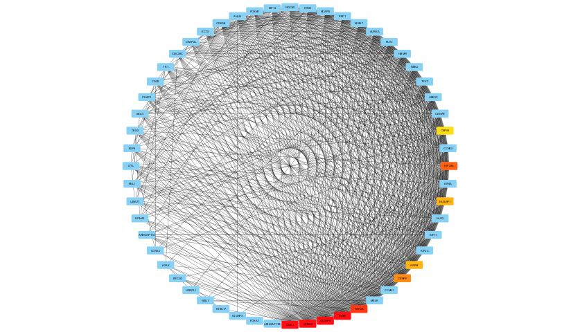

# breast-cancer-expression-signatures

📊 Overview
This repository presents a comprehensive transcriptomic analysis of breast cancer, focusing on the identification of differentially expressed genes (DEGs) between tumor and normal tissues. The study integrates statistical modeling, visualization, and network biology to uncover potential biomarkers and therapeutic targets.

🧪 Objectives
Identify key genes dysregulated in breast cancer

Visualize expression patterns using volcano plots and heatmaps.

Construct gene interaction networks to highlight the functional relationships between genes.

Detect hub genes
