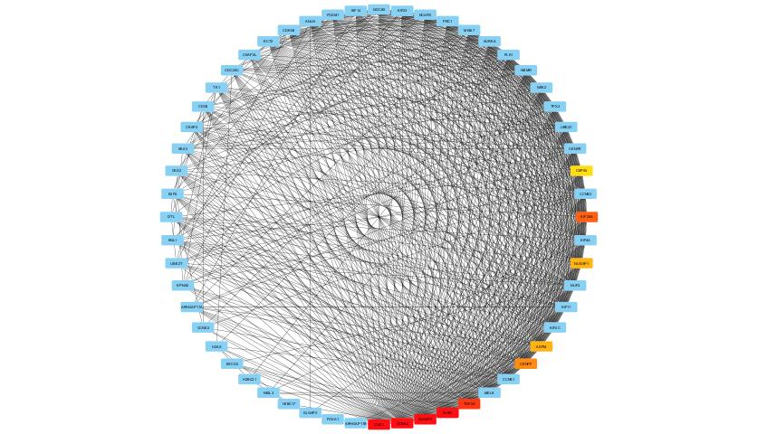

# In silico identification of CDK1 as a candidate target in breast cancer via integrative transcriptomic and docking analysis of Moringa Oleifera compounds

## 📊 Overview
This repository presents a comprehensive transcriptomic analysis of breast cancer, focusing on the identification of differentially expressed genes (DEGs) between tumor and normal tissues. The study integrates statistical modeling, visualization, and network biology to uncover potential biomarkers and therapeutic targets.

## 🔬 Publication Details
**This work has been published in:** [Discover Chemistry, Springer , 2025]

**DOI:** https://doi.org/10.1007/s44371-025-00405-7

**Citation:** Ojo, I. D., Olusanya, M. D., Oyelere, T. E., Olopoda, A. I., Akinola, O. D., & Elekofehinti, O. O. (2025b). In silico identification of CDK1 as a candidate target in breast cancer via integrative transcriptomic and docking analysis of Moringa Oleifera compounds. Discover Chemistry., 2(1). https://doi.org/10.1007/s44371-025-00405-7

## 🧪 Objectives
- Identify key genes dysregulated in breast cancer
- Visualize expression patterns using volcano plots and heatmaps
- Construct gene interaction networks to highlight functional relationships between genes
- Detect hub genes as potential therapeutic targets

